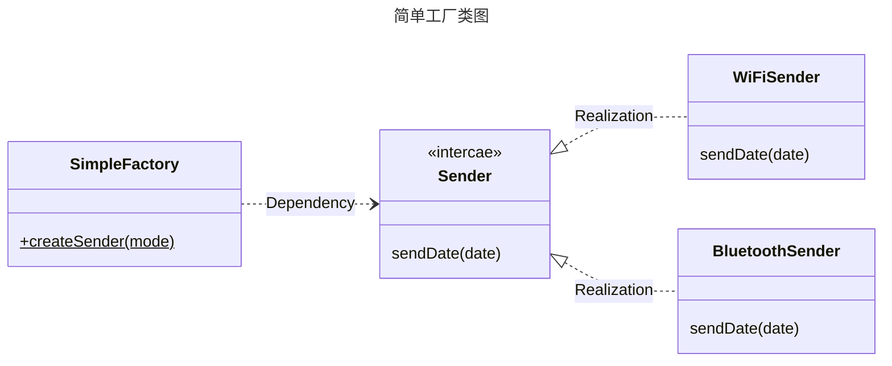
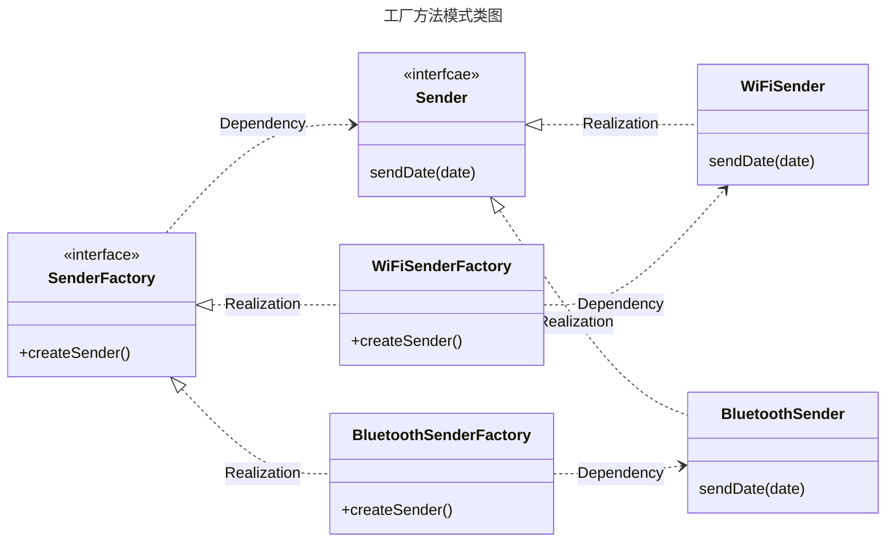
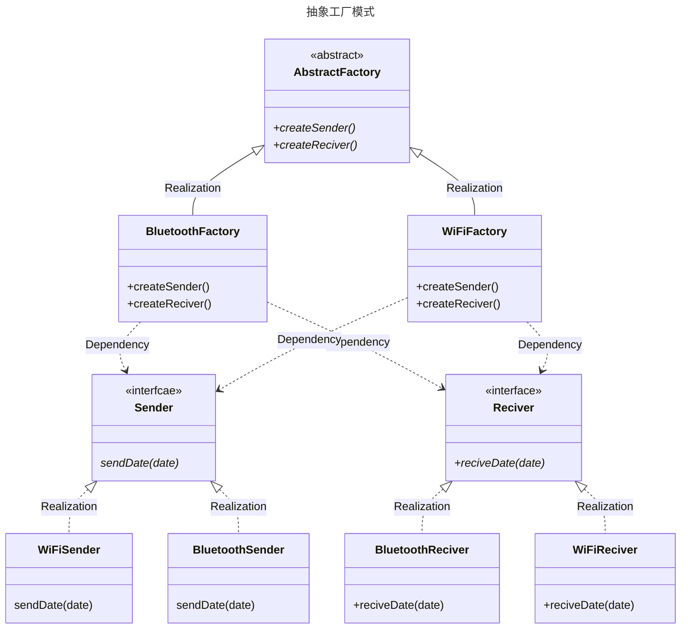
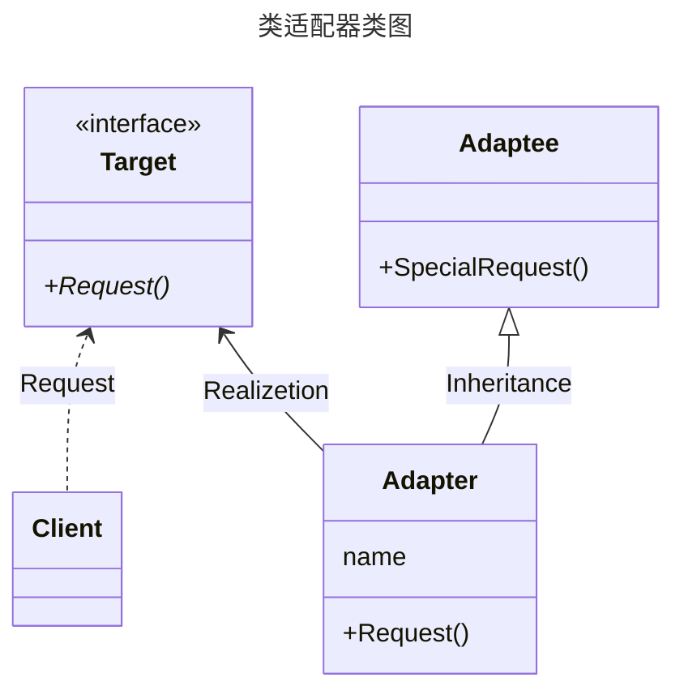
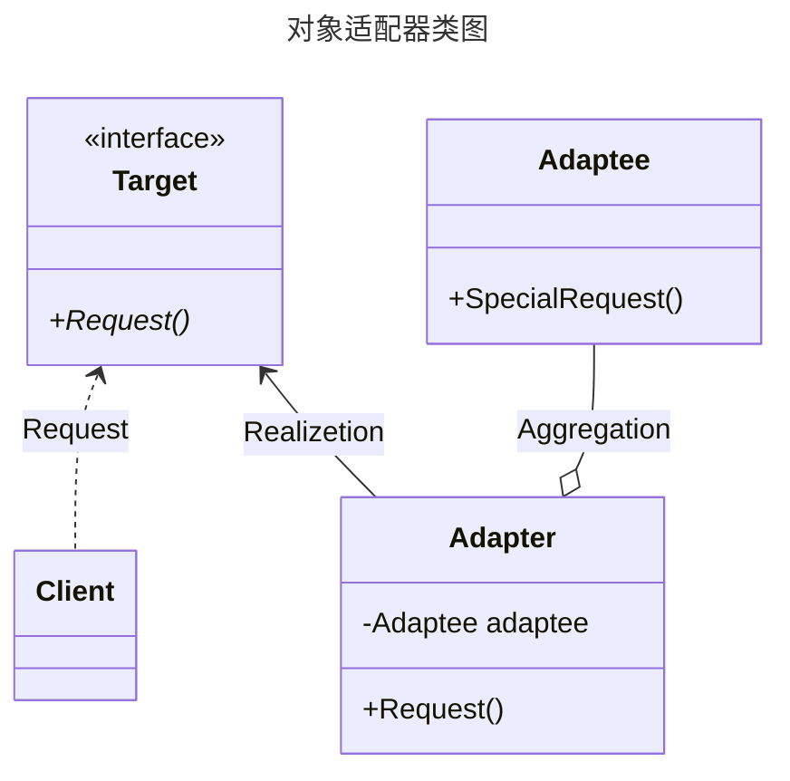
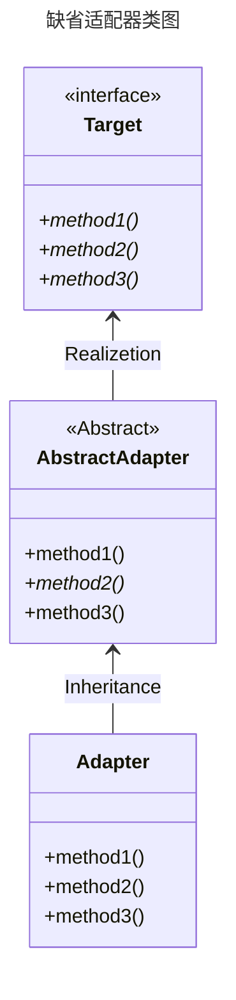
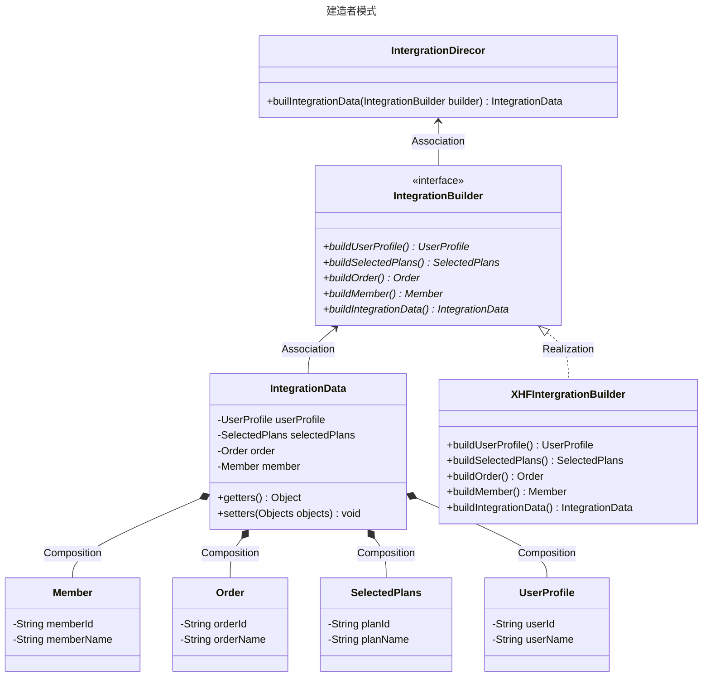

# 设计模式

- [设计模式](#设计模式)
  - [工厂模式](#工厂模式)
    - [简单工厂模式](#简单工厂模式)
    - [工厂方法模式](#工厂方法模式)
    - [抽象工厂模式](#抽象工厂模式)
  - [单例模式](#单例模式)
    - [饿汉模式](#饿汉模式)
    - [懒汉模式](#懒汉模式)
      - [懒汉模式(线程不安全)](#懒汉模式线程不安全)
      - [懒汉模式(方法同步)](#懒汉模式方法同步)
      - [DCL](#dcl)
      - [静态内部类](#静态内部类)
      - [懒汉模式防止反射、克隆和序列化侵入](#懒汉模式防止反射克隆和序列化侵入)
    - [枚举类](#枚举类)
  - [适配器模式](#适配器模式)
    - [类适配器模式](#类适配器模式)
    - [对象适配器模式](#对象适配器模式)
    - [接口适配器模式(缺省适配器模式)](#接口适配器模式缺省适配器模式)
  - [建造者模式](#建造者模式)
  - [代理模式](#代理模式)
    - [动态代理](#动态代理)
    - [静态代理](#静态代理)
  - [装饰器模式](#装饰器模式)
  - [委托模式](#委托模式)
  - [责任链模式](#责任链模式)
  - [组合模式](#组合模式)
    - [透明模式](#透明模式)
    - [安全模式](#安全模式)
  - [享元模式](#享元模式)

设计模式一般被分为三类

- 创建型模式
- 结构型模式
- 行为型模式

## 工厂模式

工厂模式用于对实现逻辑的封装，通过公共接口提供对象的实例化服务，在新增类时不需要过多修改。以传输数据的背景为例，从简单工厂模式开始分析利弊

### 简单工厂模式

当需要新增 Sender 时，不仅需要实现对应的 Sender 类， 还需要修改 SimpleFactory 中的判断条件，用以选择对应的 Sender，这样违背了`开闭原则`。在判定条件中当然可以通过反射的方式避免修改 SimpleFactory。但反射的代价是降低程序的运行效率。



### 工厂方法模式

工厂方法模式将工厂进行了抽象，当需要新增发送方式，即新增类时，我们只需要新增对应的工厂实现和发送类，而不需要侵犯现有的类结构。



### 抽象工厂模式

抽象工厂模式不仅将产品类抽象出来，而且还将工厂类抽象出来。假设需要新增Reciver 抽象类，对应的工厂需要管理的时 Sender 和 Reciver，工厂方法模式将会面临具体工厂类和具体功能类爆炸的情况，因此在管理多种功能或者说产品组合的时候，抽象工厂比工厂方法类更优。



## 单例模式

许多时候整个系统只需要拥有一个全局对象，有利于协调系统整体行为。比如读取配置信息、线程池、缓存和网络请求等。当出现多个实例时，可能会出现程序异常行为、结果不一致、频繁创建销毁对象等问题。

### 饿汉模式

饿汉模式在类加载的时候就创建的静态实例，不论是否用到该实例。当此类实例较多时，会影响程序的效率。以下为饿汉模式的实现。

```java
public class Hunger implements Cloneable, Serializable {
    private Hunger() {}

    // final static 修饰, 改属性不可更改且在类加载时初始化。线程安全
    private static final Hunger instance = new Hunger();

    public static Hunger getInstance() {
        return instance;
    }

    @Override
    protected Object clone() throws CloneNotSupportedException {
        return super.clone();
    }
}
```

### 懒汉模式

懒汉模式区别于饿汉模式特点是延时加载，即在实例第一次被获取的时候才被创建，容易造成线程不安全的情况，往往需要通过加锁等方式，一定程度上影响性能。

#### 懒汉模式(线程不安全)

懒汉模式最简单的实现形式，线程不安全。

```java
/**
 * 懒汉模式，创建第一次创建实例时初始化，多线程不安全，
 */
public class LazyOne implements Cloneable, Serializable {
    private LazyOne() {};
    private static LazyOne instance = null;

    public static LazyOne getInstance() {
        if (instance == null) {
            instance = new LazyOne();
        }
        return instance;
    }

    @Override
    protected Object clone() throws CloneNotSupportedException {
        return super.clone();
    }
}

```

#### 懒汉模式(方法同步)

由于最基本的懒汉模式是多线程不安全的，即有可能多个线程同时进入条件语句，导致创建了多个不同实例，因此通过创建 `getInstance()` 方法的锁同步。方法同步的缺点是，在后续获取实例时其实并不需要再进行同步，从而导致该方法执行效率较低

```java
/**
 * 增加类方法锁，效率较低，但是可以保证线程安全
 */
public class LazyTwo implements Cloneable, Serializable {
    private LazyTwo() {}

    private static LazyTwo instance = null;

    public static synchronized LazyTwo getInstance() {
        if (instance == null) {
            instance = new LazyTwo();
        }
        return instance;
    }

    @Override
    protected Object clone() throws CloneNotSupportedException {
        return super.clone();
    }
}
```

#### DCL

双重检验在 `getInstance()` 中加入了双重检测，在第二重检测的地方才增加锁。从而时后续实例完成创建后可以不进入同步方法快，提高了效率。

```java
public class LazyThree implements Cloneable, Serializable {

    // volatile 防止 jvm 乱序执行 从而导致的异常
    private static volatile LazyThree instance = null;

    private LazyThree() {}

    // Double-Check 线程安全
    public static LazyThree getInstance() {
        if (instance == null) {
            synchronized(LazyThree.class) {
                if (instance == null) {
                    instance = new LazyThree();
                }
            }
        }
        return instance;
    }

    @Override
    protected Object clone() throws CloneNotSupportedException {
        return super.clone();
    }
}
```

#### 静态内部类

利用静态内部类的方式实现单例，静态内部类只有当其被调用时才汇执行类加载，且其静态属性只会在第一次加载类时初始化，因此静态内部类即实现了单例的多线程安全性，又可以延迟在家单例。但外部无法传递参数到静态内部类中。

```java
/**
 * 内部静态类，参数传递无法实现，线程安全，无法防止序列化、反射和克隆
 */
public class LazyFour implements Cloneable, Serializable {
    private LazyFour() {}

    // final 保证方法不被重写
    public static final LazyFour getInstance() {
        return LazyHolder.LAZY;
    }
    // 内部静态类，只有当被调用的时候才会执行类加载，且类静态属性只会在第一次加载类时初始化，从而保证单例
    private static class LazyHolder {
        private static final LazyFour LAZY = new LazyFour();
        
    }
        
    @Override
    protected Object clone() throws CloneNotSupportedException {
        return super.clone();
    }
}
```

#### 懒汉模式防止反射、克隆和序列化侵入

以上懒汉模式都无法避免反射、克隆和序列化的侵入，单例模式并不是完全安全的。为防止反射、克隆和序列化的侵入，从其实现原理上出发，解决对应的问题。

- 反射
  > 反射借助类加载器并修改私有方法的访问权限，从而直接调用构造器。因此，可以通过设置静态变量作为临界资源标记是否为第一次创建实例，从而防止通过反射直接调用构造器创建新实例。
- 克隆
  > 通过重载克隆方法并使其返回当前实例即可保证克隆的实例和当前实例一致
- 序列化
  > 序列化的方式会在 `ObjectInputStream.readObject()` 方法中判断类是否定义了 `readResovle()` 方法，如果该方法没有被定义，则会调用构造器创建实例，否则调用 `readResovle()` 方法创建实例。

```java
public class LazyFive implements Cloneable, Serializable {

    // 防止反射，静态变量作为临界资源，标记是否第一次创建对象
    private static boolean isFirstCreate = true;

    private LazyFive() {
        if(isFirstCreate) {
            synchronized(LazyFive.class) {
                if (isFirstCreate) {
                    isFirstCreate = false;
                }
            }
        } else {
            // 当两个进程都通过第一个条件语句时，该异常不会被出发
            throw new RuntimeException("已经实例化一次了");
        }
    }

    // final 保证方法不被重写
    public static final LazyFive getInstance() {
        return LazyHolder.LAZY;
    }
    // 内部静态类，只有当被调用的时候才会执行类加载，且类静态属性只会在第一次加载类时初始化，从而保证单例
    private static class LazyHolder {
        private static final LazyFive LAZY = new LazyFive();
        
    }
    
    // 重写克隆方法直接返回当前实例，
    @Override
    protected Object clone() throws CloneNotSupportedException {
        return LazyFive.getInstance();
    }

    private Object readResolve() {
        return LazyFive.getInstance();
    }

    
}

class IntrusiveTest5 {
    public static void main(String[] args) throws Exception {
        LazyFive obj = LazyFive.getInstance();
        System.out.println("正常获取的对象" + obj);
        // 反射
        Constructor<LazyFive> constructor = LazyFive.class.getDeclaredConstructor();
        constructor.setAccessible(true);
        LazyFive reflectObj = constructor.newInstance();
        System.out.println("通过反射获取的对象：" + reflectObj);
       
        // 克隆
        LazyFive cloneObj = (LazyFive) LazyFive.getInstance().clone();
        System.out.println("通过克隆获取的对象： " + cloneObj);

        // 序列化
        ByteArrayOutputStream byteArrayOutputStream = new ByteArrayOutputStream();
        ObjectOutputStream objectOutputStream = new ObjectOutputStream(byteArrayOutputStream);
        objectOutputStream.writeObject(LazyFive.getInstance());
        ByteArrayInputStream byteArrayInputStream = new ByteArrayInputStream(byteArrayOutputStream.toByteArray());
        ObjectInputStream ObjectInputStream = new ObjectInputStream(byteArrayInputStream);

        LazyFive serializedObj = (LazyFive) ObjectInputStream.readObject();

        if (byteArrayOutputStream != null) byteArrayOutputStream.close();
        if (objectOutputStream != null) objectOutputStream.close();
        if (byteArrayInputStream != null) byteArrayInputStream.close();
        if (ObjectInputStream != null) ObjectInputStream.close();
        System.out.println("通过序列化获取的对象： " + serializedObj);
    }
}
```

### 枚举类

枚举类是被提倡的单例实现方式

- 首先其可以保证线程安全(枚举类的字节码中，枚举类被编译为 final 修饰的普通类， final static 修饰类属性，因此枚举类在项目启动时就会被加载并初始化)。
- 枚举类默认继承自 `Enum.class`，该类的 clone 方法被修饰为 final，无法被重写，同时该方法直接抛出  `CloneNotSupportedException` 异常，因此枚举类默认禁用 clone 方法。
- 反射时枚举类方法的 `getDeclaredConstructor()` 最终会调用 `getConstructor0()` 方法，然后根据 `parameterTypes` 和 `constructor.getParameterTypes()` 判断，普通类中 `parameterTypes` 和 `constructor.getParameterTypes()` 均为空值，而枚举类 `constructor.getParameterTypes()` 将返回 数组 [class java.lang.String, int]，从而抛出 `NoSuchMethodException` 异常。
- 反序列在 `readObject()` 方法会调用 `readObject0()`, 枚举选择 `readEnum(unshared)` 方法，其中采用 `Enum.valueOf((Class)cl, name)` 获取的值和采用 `EnumSingleton.INSTANCE` 获取的是同一个对象。
<!-- TODO 反射和反序列化的逻辑 -->

```java
/**
 * 枚举单例
 */
public enum EnumSingleton {
    INSTANCE();

    private EnumSingleton() {
    };

    // Cannot override the final method from Enum<EnumSingleton>
    // @Override
    // protected Object clone() throws CloneNotSupportedException {
    // return super.clone();
    // }
}
```

[枚举防止反射、克隆和序列化的原理](https://www.cnblogs.com/call-me-pengye/p/11214435.html)

[单例模式的实现方式及如何有效防止防止反射和反序列化](https://www.cnblogs.com/call-me-pengye/p/11169051.html)

## 适配器模式

适配器模式通常用于兼容不同接口，通过新增适配器类使得不同接口协同工作。  
适配器模式包括三种形式：

- 类适配器模式
- 对象适配器模式
- 接口适配器模式。

### 类适配器模式

类适配器使用的是继承的方式，一般来说无法对其子类进行适配



### 对象适配器模式

对象适配器使用的是组合的方式，它把源类作为属性放入适配器类中



### 接口适配器模式(缺省适配器模式)

省适配模式为一个接口提供缺省实现，这样的类型可以从这个缺省实现进行扩展，而不必从原有接口进行扩展。通过接口和抽象类的结合，避免了在实现接口的子类中出现大量的“无意义”实现，这个“无意义”实现，被缓冲到了抽象类中

由缺省适配器类直接实现目标接口，并为所有方法提供缺省的空实现。用户类就只需要继承适配器类，只实现需要的方法。



## 建造者模式

建造者模式将复杂对象的表示和构建分离，使同样的构建过程可以创建不同的表示。当构建的基本部件不变化而其组合经常变化时，可以使用该方法。



## 代理模式

### 动态代理

### 静态代理

## 装饰器模式

## 委托模式

## 责任链模式

## 组合模式

### 透明模式

### 安全模式

## 享元模式
